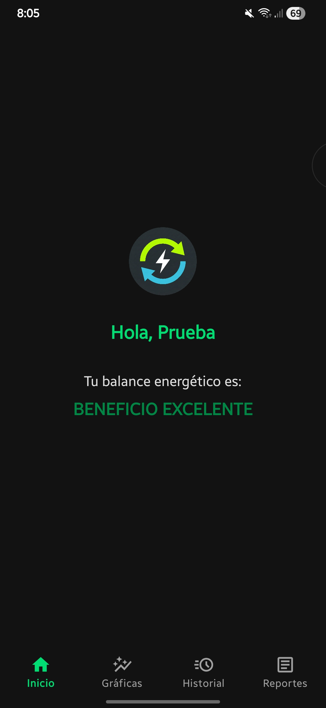
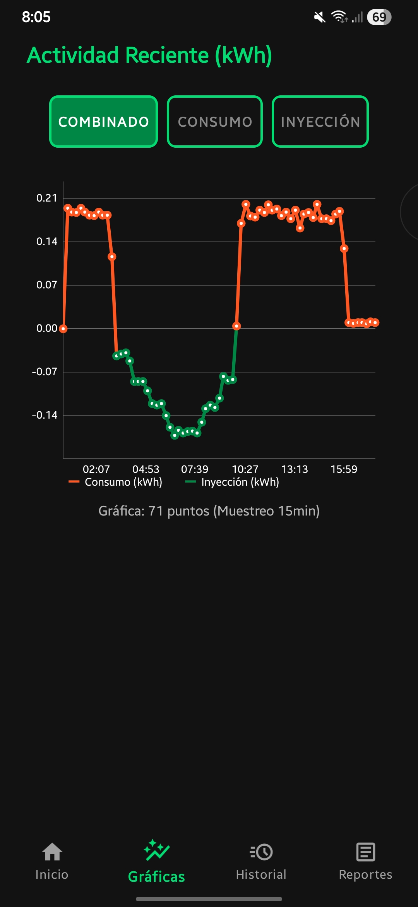

# Sistema IoT de Monitoreo Energético Bidireccional

BiSense es una solución integral de hardware y software diseñada para viviendas equipadas con paneles solares. El sistema permite a los usuarios monitorear en tiempo real su consumo eléctrico frente a la inyección de energía excedente a la red, facilitando la toma de decisiones para optimizar el gasto energético.

## Documentación e Investigación Académica
El desarrollo de este sistema está respaldado por investigación formal. Puedes consultar la arquitectura del hardware, la justificación del prototipo y la lógica de medición en el artículo técnico adjunto:
**[Leer: Prototipo (PDF)](./docs/prototipo.pdf)**

## Arquitectura del Sistema

El proyecto se divide en tres capas principales:
1. **Hardware (Sensorización):** Microcontrolador ESP32 encargado de procesar lecturas automáticas de consumo/generación cada 15 minutos.
2. **Backend (Nube):** Firebase gestiona la sincronización de datos en tiempo real y el diagnóstico de salud de la conexión inalámbrica.
3. **Frontend (Móvil):** Aplicación nativa en Kotlin con arquitectura orientada a la visualización de datos y reportes.

## Funcionalidades Principales

* **Sincronización y Diagnóstico:** El sistema alerta visualmente si el hardware pierde conexión con la red o deja de transmitir datos.
* **Dashboard Interactivo:** Gráficas de análisis dinámico con filtros de visualización (Consumo, Inyección o Combinado) y segmentación temporal.
* **Motor de Facturación PDF:** Generación automatizada de reportes financieros nativos desde la app, integrando un algoritmo de estimación basado en la **Tarifa Doméstica Tipo 1 de la CDMX**.

| Pantalla Principal | Pantalla de Gráficas |
| :---: | :---: |
|  |  |

## Stack Tecnológico

- **Lenguaje:** Kotlin
- **IDE:** Android Studio
- **Base de Datos:** Firebase (Realtime Database)
- **Hardware:** C++ (ESP32)
